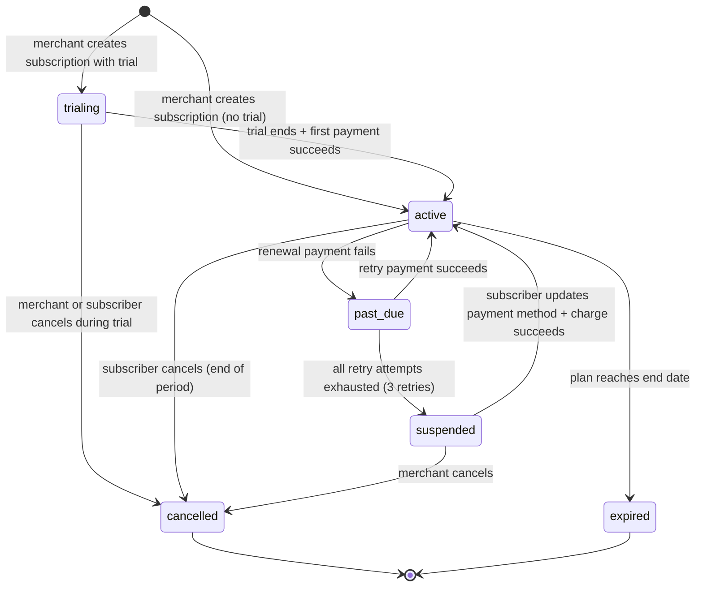

# Billing State Machine

## Six Subscription States



## State Definitions

| State | Meaning | Access | Dunning Active? |
|-------|---------|--------|-----------------|
| `trialing` | Free trial period, no charge yet | Full access | No |
| `active` | Paid and current | Full access | No |
| `past_due` | Renewal failed, retrying | Full access (grace) | **Yes** |
| `suspended` | All retries exhausted | **No access** | No |
| `cancelled` | Ended by merchant or subscriber | No access | No |
| `expired` | Plan reached its end date | No access | No |

## Dunning Schedule (past_due state)

| Retry | Delay After Failure | Action on Fail | Action on Success |
|-------|-------------------|----------------|-------------------|
| 1st | 1 day | Stay `past_due`, schedule retry 2 | → `active` |
| 2nd | 3 days after retry 1 | Stay `past_due`, schedule retry 3 | → `active` |
| 3rd | 7 days after retry 2 | → `suspended` | → `active` |

Total grace period: **11 days** from first failure to suspension.

## Transition Rules (Enforced in Code)

```python
VALID_TRANSITIONS = {
    "trialing":  ["active", "cancelled"],
    "active":    ["past_due", "cancelled", "expired"],
    "past_due":  ["active", "suspended"],
    "suspended": ["active", "cancelled"],
    "cancelled": [],   # terminal
    "expired":   [],   # terminal
}
```

## Events Generated

Every transition creates an `Event` record:

| Trigger | Event Type | Example |
|---------|-----------|---------|
| First payment succeeds | `subscription.activated` | Trial → Active |
| Renewal payment fails | `payment.failed` | Active → Past Due |
| Retry succeeds | `payment.succeeded` | Past Due → Active |
| All retries exhausted | `subscription.suspended` | Past Due → Suspended |
| Subscriber cancels | `subscription.cancelled` | Active → Cancelled |
| Card updated + charged | `subscription.reactivated` | Suspended → Active |

_Last updated: 2026-06-30_
