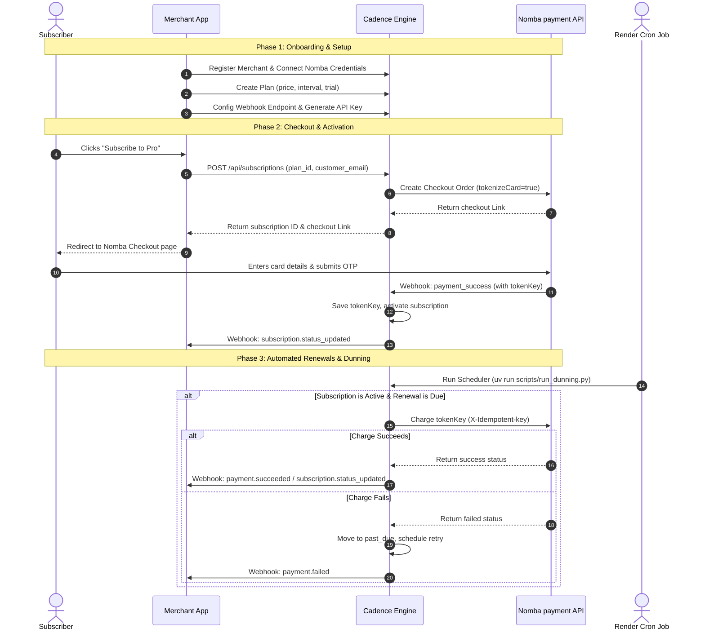

# Cadence Developer Integration Flow

> This guide describes the end-to-end flow of how a developer integrates their application with Cadence to automate subscription billing using Nomba.

---

## High-Level Sequence Diagram

The following diagram illustrates the complete subscription lifecycle, from initial customer checkout to automated renewal cron jobs.



---

## 1. Developer Integration Steps

### Step A: Register & API Key
First, create your merchant account at `/api/auth/register` (you must provide your `nomba_client_id`, `nomba_client_secret`, and `nomba_account_id`). 
Then, all API requests require a Bearer token generated inside the merchant dashboard:
```http
Authorization: Bearer cd_proj_123abc...
```

### Step B: Create a Plan
Define the product details, interval, and price:
```bash
curl -X POST https://cadence.onrender.com/api/plans \
  -H "Authorization: Bearer cd_..." \
  -H "Content-Type: application/json" \
  -d '{
    "name": "Pro Monthly",
    "amount": 2000.00,
    "currency": "NGN",
    "interval_days": 30,
    "trial_days": 0
  }'
```

### Step C: Initialize Subscription Checkout
When a user subscribes on your frontend, call Cadence to generate a checkout session:
```bash
curl -X POST https://cadence.onrender.com/api/subscriptions \
  -H "Authorization: Bearer cd_..." \
  -H "Content-Type: application/json" \
  -d '{
    "plan_id": "plan_abc123",
    "customer_email": "customer@example.com",
    "customer_name": "Tunde Balogun",
    "callback_url": "https://your-app.com/checkout/success"
  }'
```
Redirect the subscriber to the returned `checkout_link` to enter their payment details.

### Step D: Listen to Webhooks
Configure your backend to receive POST webhooks from Cadence. Verify the signature and handle events:
- `subscription.status_updated`: Enable or disable access based on the new status (`active` or `suspended`/`expired`).
- `payment.succeeded`: Log successful payment event.
- `payment.failed`: Warn user of payment issue.
- `subscription.cancelled`: Disable access to your product.

---

## 2. Merchant Dashboard: Operations & Monitoring

The dashboard is the merchant's control panel. It is strictly an operations tool and does not impact automated customer charge flows.

### Dashboard Layout & Sections

| Section | What it Displays | Key User Interactions (Buttons) |
|---------|------------------|---------------------------------|
| **Project Switcher** | List of all merchant projects. | Create a new project; switch active project. |
| **Credentials Setup** | Status of connection to Nomba. | Input `client_id`, `client_secret`, and `account_id` to connect the project. |
| **Overview Metrics** | - Monthly Recurring Revenue (MRR)<br>- Active subscription count<br>- Churn rate<br>- Failed charge rate. | Date filters. |
| **Plans Directory** | List of active and archived plans. | - Create new plan<br>- Soft-delete/archive plan. |
| **Subscriptions Desk** | Table of subscribers, emails, plans, current status, and next renewal dates. | - View subscriber history<br>- Cancel subscription immediately<br>- Trigger a manual refund on a payment<br>- Generate & copy a Portal Magic Link to email to a customer. |
| **Audit Logs** | Real-time feed of events, cron executions, webhook requests, and payment attempts. | Search and filter logs by subscription ID or event type. |
| **Project Settings** | API keys, active webhook endpoints. | - Generate/Revoke API keys<br>- Set/test Webhook destination URL. |
